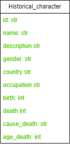
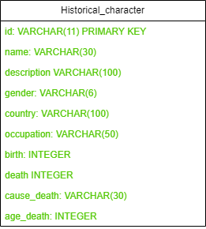

# Projeto voltado para criar um banco de dados Sqlite para manter dados de usuários

O projeto consiste em criar um banco de dados Sqlite para manter dados de usuários segundo o diagrama apresentado na seção sobre os banco de dados, e o consumir via FastAPI.

## Frameworks usados

- FastAPI
- Poetry
- Sqlite

## Dados Usados

Para aproximar o sistema da realizade, usaremos o dataset [AgeDatasetet-V1.csv](https://www.kaggle.com/datasets/imoore/age-dataset).

O dataset é composto por uma única tabela com 10 colunas e contem 1_223_010 Linhas

### Colunas

- Id,
- Name,
- Short description,
- Gender,
- Country,
- Occupation,
- Birth year,
- Death year,
- Manner of death,
- nameAge of death

### Preview dos Dados

| Id  | Name                  | Short description                                    | Gender | Country                                      | Occupation    | Birth year | Death year | Manner of death | Age of death |
|-----|-----------------------|------------------------------------------------------|--------|----------------------------------------------|---------------|------------|------------|-----------------|--------------|
| Q23 | George Washington     | 1st president of the United States (1732–1799)      | Male   | United States of America; Kingdom of Great Britain | Politician    | 1732       | 1799       | natural causes  | 67           |
| Q42 | Douglas Adams         | English writer and humorist                          | Male   | United Kingdom                              | Artist        | 1952       | 2001       | natural causes  | 49           |
| Q91 | Abraham Lincoln       | 16th president of the United States (1809-1865)      | Male   | United States of America                     | Politician    | 1809       | 1865       | homicide        | 56           |
| Q254| Wolfgang Amadeus Mozart | Austrian composer of the Classical period         | Male   | Archduchy of Austria; Archbishopric of Salzburg | Artist      | 1756       | 1791       |                 | 35           |
| Q255| Ludwig van Beethoven  | German classical and romantic composer               | Male   | Holy Roman Empire; Austrian Empire           | Artist        | 1770       | 1827       |                 | 57           |
| Q260| Jean-François Champollion | French classical scholar                          | Male   | Kingdom of France; First French Empire        | Egyptologist  | 1790       | 1832       | natural causes  | 42           |
| Q272| Paul Morand           | French writer                                        | Male   | France                                       | Artist        | 1888       | 1976       |                 | 88           |
| Q296| Claude Monet          | French impressionist painter (1840-1926)             | Male   | France                                       | Artist        | 1840       | 1926       | natural causes  | 86           |
| Q297| Diego Velázquez       | Spanish painter (1599-1660)                          | Male   | Spain                                        | Artist        | 1599       | 1660       |                 | 61           |
| Q301| El Greco              | Greek painter, sculptor and architect                | Male   | Spain; Republic of Venice                   | Artist        | 1541       | 1614       |                 | 73           |

## Banco de Dados

Nesta seção iremos apresentar a estrutura do banco de dados e suas características.

### Modelagem do CSV para SQL

Visando formatar as colunas através de boas praticas, alteramos as colunas do dataset para mantendo a ordem e apenas alterando os nomes na respectiva ordem a baixo:

- id
- name
- description
- gender
- country
- occupation
- birth
- death
- cause_death
- age_death

### Diagramas

#### MER

#### DER

### Criação do Banco de Dados

Se o banco de dados não está criado ainda, execute os arquivos recomendados a baixo

- Para criar o banco de dados execute o arquivo [create_database.py](src/modules/database/create_database.py)
- Para carregador os dados execute o arquivo [load_dataset.py](src/modules/database/load_dataset.py)
